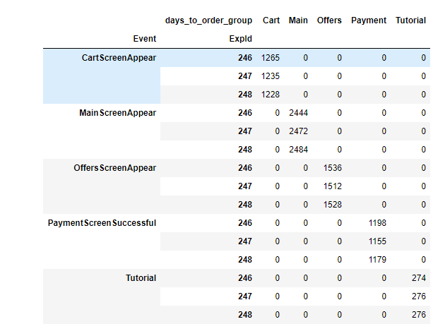
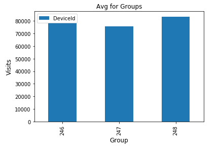

#  TripleTen Data Analytics Program Projects Overview
## List of Topics studied below:

1. Data Preprocessing (**Python, numpy**)
2. Exploratory Data Analysis (**pandas, scipy, matplotlib**)
3. Statistical Data Analysis (**probability theory, statistics, hypotheses testing**)
4. Data Collection and Storage (**HTML, SQL, web scraping**)
5. Business Analytics (**LTV, CAC, ROMI, cohort analysis**)
6. Making Business Decisions Based on Data (**hypotheses prioritization, A/B testing**)
7. Tell story using data (**plotly, seaborn**)
8. Automation (**ETL, DASH, Tableau**)
9. Forecasts and Predictions (**Machine Learning**)

Some of the projects I've completed during Yandex's Practicum Data Analyst Program below:
  1. [Jupyter Notebook](#jn)
  - [Marketing Expenses Research](#marketing)
  - [Online Store A/B Testing](#online_store)
  - [Food Market Research](+food)
  - [Mobile App Conversion](#mobile)

  2. [Tableau Visualizations](#tableau)
  - [Trending Youtube Videos](#yb)
  - [Various Dashboards](#vd)   

# Jupyter notebook

## [Marketing Expenses Research](https://github.com/adnankan01/Adnans_Portfolio/tree/main/Marketing%20Expenses%20Research)

 
 For this project I've analysed data on marketing costs, visits and orders for Yandex.Afisha:
 * Described how clients used the product and when they made purchases
 * Calculated retention rates
 * Performed cohort analysis
 * Explained which marketing costs were worthwhile
 * Came up with product and marketing campaign improvements

**Conclusion:**
Advise marketing experts how much money to invest and where. What sources/platforms would you recommend? Back up your choice. What metrics did you focus on? Why? What conclusions did you draw after finding the metric values?

1. Very few users return to the product on a weekly or monthly basis so focusing on making users come back more often by including additional features or services could help.
2. Touch based visits are less popular and therefor Yandex should consider devoting resources to improving the experience since lots of people use their phones/apps now a days and everyone has a smart phone.
3. Yandex should look at dropping sources 7 and 10 as they are most ineffective. It would be wise to reduce investment through source 3 and start investing more in source 4 and 5.
4. ROMI IS best on Sources 1,5 and 2 with 1 being the Lowest in CAC and second highest in Revenue.
5. Yandex should revisit its strategy in use around Sept 2017 as there was a big increase in orders.
6. Yandex may want to consider giving incentives more often to onboard more customers, which will increase sales in future months. It seems as though it has some large clients based on AVG monthly reventues and it wouldn't be a bad idea to have a special kind of deal for these clients to lead to more purchaes and easier budgeting decisions.
   
**Key words**: LTV, CAC, ROMI, retention, cohort analysis. 

**Libraries used**: pandas, matplotlib, seaborn, scipy.

## [Online store A/B testing](https://github.com/adnankan01/Adnans_Portfolio/tree/main/Online%20Store%20AB%20Testing)
 
 In this project I've worked with online store orders and visits:
 * Prioritised list of hypotheses to test using ICE and RICE scores
 * Analysed results of A/B test: compared cumulative revenue, order size, conversion rate for each group
 * Detected anomalies in data
 * Checked whether there was statistical significance between groups using data with and without anomalies
 * Provided recommendations whether to stop or continue A/B test
 
**Key words**: hypotheses prioritization, hypotheses testing, A/B testing

**Libraries used**: pandas, matplotlib, scipy, seaborn

## [Food market research](https://github.com/adnankan01/Adnans_Portfolio/tree/main/Food%20Market%20Research)

 
 Here I've worked with data on food market in LA to provide recommendations to investors:
 * Counted various establishment types
 * Found dependencies between type of establishment and belonging to a chain
 * Visualised number of seats distribution
 * Investigated LA streets with a lot of restaurants
 * Described strategies for successful restaurant opening
 
**Key words**: pie chart, bar plot, scatter plot, distribution plot. 

**Libraries used**: pandas, matplotlib, numpy, plotly, seaborn.

## [Mobile app conversion](https://github.com/adnankan01/Adnans_Portfolio/tree/main/Mobile%20App%20Conversion)

 
 In this project I've analysed mobile app logs:
 * Determined how many logs are there per each date, chose a suitable date interval for analysis
 * Created event funnel to understand when users leave the app
 * Developed recommendations on conversion improvement
 * Checked whether new design was beneficial using the results of A/A/B test
 
**Key words**: sales funnel, conversion, A/B test, user behaviour. 

**Libraries used**: pandas, plotly, seaborn, scipy.

# Tableau visualizations
### [Trending YouTube Videos Dashboard](https://public.tableau.com/profile/adnan2635#!/vizhome/PYTestDash/Dashboard1)

Dashboard shows trending YouTube video ads per country and category over time.

## Previous dashboards made by me showcasing Various Monthly Team Case and Saving Totals

