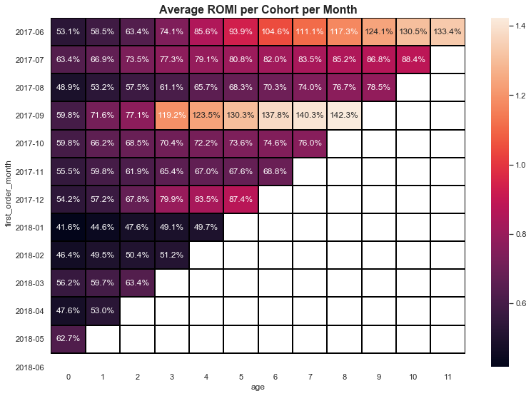
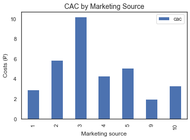

#  Yandex Practicum Projects Overview
List of Topics studied below:

1. Data Preprocessing (**Python, numpy**)
2. Exploratory Data Analysis (**pandas, scipy, matplotlib**)
3. Statistical Data Analysis (**probability theory, statistics, hypotheses testing**)
4. Data Collection and Storage (**HTML, SQL, web scraping**)
5. Business Analytics (**LTV, CAC, ROMI, cohort analysis**)
6. Making Business Decisions Based on Data (**hypotheses prioritization, A/B testing**)
7. Tell story using data (**plotly, seaborn**)
8. Automation (**ETL, DASH, Tableau**)
9. Forecasts and Predictions (**Machine Learning**)

Some of the projects I've completed during Yandex's Practicum Data Analyst Program below:
  1. [Jupyter Notebook](#jn)
  - [Marketing Expenses Research](#marketing)
  - [Online Store A/B Testing](#online_store)
  - [Food Market Research](+food)
  - [Mobile App Conversion](#mobile)

  2. [Tableau Visualizations](#tableau)
  - [Various Dashboards](#vd) 
  - [Trending Youtube Videos](#yb)
  

# Jupyter notebook

## [Marketing Expenses Research](https://github.com/adnankan01/Adnans_Portfolio/tree/main/BusAnalyticsProject)
 
 For this project I've analysed data on marketing costs, visits and orders for Yandex.Afisha:
 * Described how clients used the product and when they made purchases
 * Calculated retention rates
 * Performed cohort analysis
 * Explained which marketing costs were worthwhile
 * Came up with product and marketing campaign improvements
 
**Key words**: LTV, CAC, ROMI, retention, cohort analysis. 

**Libraries used**: pandas, matplotlib, seaborn, scipy.

## [Online store A/B testing]()
 
 In this project I've worked with online store orders and visits:
 * Prioritised list of hypotheses to test using ICE and RICE scores
 * Analysed results of A/B test: compared cumulative revenue, order size, conversion rate for each group
 * Detected anomalies in data
 * Checked whether there was statistical significance between groups using data with and without anomalies
 * Provided recommendations whether to stop or continue A/B test
 
**Key words**: hypotheses prioritization, hypotheses testing, A/B testing

**Libraries used**: pandas, matplotlib, scipy, seaborn

## [Food market research]()
 
 Here I've worked with data on food market in LA to provide recommendations to investors:
 * Counted various establishment types
 * Found dependencies between type of establishment and belonging to a chain
 * Visualised number of seats distribution
 * Investigated LA streets with a lot of restaurants
 * Described strategies for successful restaurant opening
 
**Key words**: pie chart, bar plot, scatter plot, distribution plot. 

**Libraries used**: pandas, matplotlib, numpy, plotly, seaborn.

## [Mobile app conversion]
()

 
 In this project I've analysed mobile app logs:
 * Determined how many logs are there per each date, chose a suitable date interval for analysis
 * Created event funnel to understand when users leave the app
 * Developed recommendations on conversion improvement
 * Checked whether new design was beneficial using the results of A/A/B test
 
**Key words**: sales funnel, conversion, A/B test, user behaviour. 

**Libraries used**: pandas, plotly, seaborn, scipy.

# Tableau visualizations
### [Trending YouTube Videos Dashboard](https://public.tableau.com/profile/adnan2635#!/vizhome/PYTestDash/Dashboard1)

Dashboard shows trending YouTube video ads per country and category over time.

### [Various Dashboards](https://public.tableau.com/profile/adnan2635#!/)
